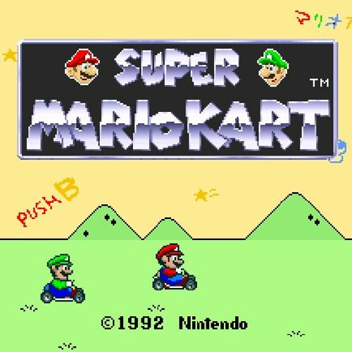
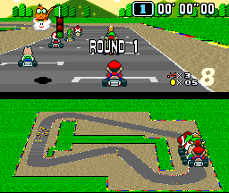
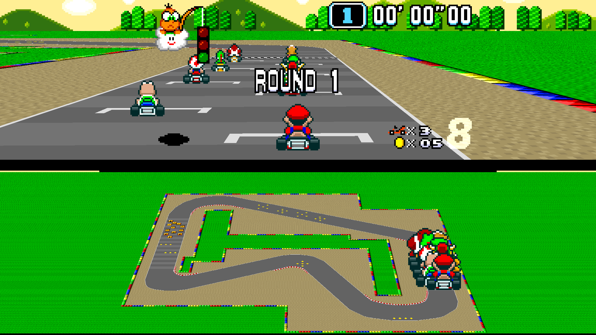
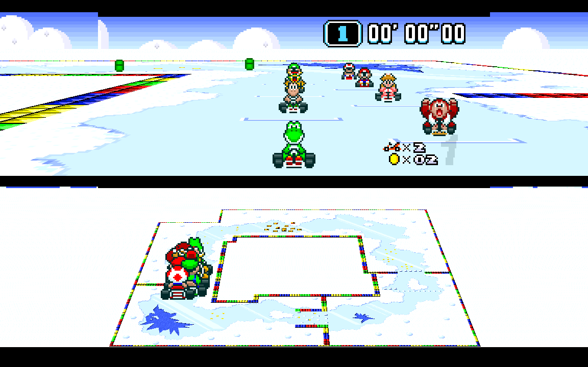
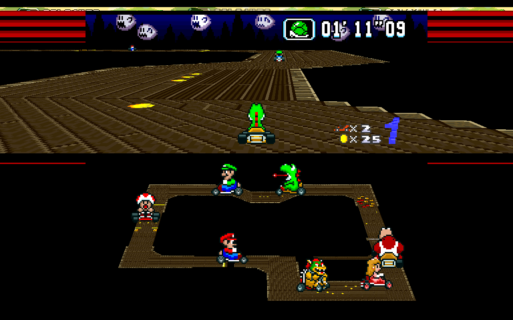

# Super Mario Kart -- a review by someone younger than the game (1/8)

Hi readers. welcome to my foray into video game writing :).

I consume a ton of video game content, and I've noticed that a lot of the good stuff is all confined in YouTube videos. I think that's a bit of a shame as someone who loves the power of text & visuals to remember and reference information. So here we are.

Mario Kart is a huge part of my childhood. I initially started playing the games with the GBA and N64 renditions; I spent countless days playing N64's amazing battle mode with my friends. I've played all of the games in the series extensively, with the exception of the SNES version (the very first one!), so I totally wanted to try it out, especially after watching [this YouTube video](https://www.youtube.com/watch?v=NDHZKYETDyU&t=1497s) about its making.

I noticed that many people tend to believe newer iterations are inherently better than their predecessors, with Mario Kart 8 Deluxe being the crown jewel of the series. Nintendo further plays into idea as they are rereleasing almost all of the old maps into the current game. However, when I was playing through the old maps on Mario Kart 8, despite them looking visually stunning, they often _didn't feel right_ and were significantly different from the appeal I remembered. So in this series of articles, I'm going to try out every Mario Kart with fresh eyes and analyze the games' mechanics, as well as try to crack out with my setup as much as possible to experience them in their best form possible nowadays.

# The setup / background

First, I approached the task of playing this game by attempting to get 1st place on every race in 150cc. However, the game was a bit too hard for me, so I mostly completed 150cc 😅.

One of my pride points is that I often figure out or find the best setups to play old games. But of course, best is subjective, so I'll do my best to explain my reasoning.

First, Super Mario Kart doesn't really have 3D, which is completely ridiculous considering it's a Mario Kart game. Well, technically, it's pseudo-3D: a textured-plane that's rotated to be the map. This is accomplished by using the SNES rendering mode "Mode 7," which you can probably find more information about by Googling. Every other element in the game is a scaled sprite, that gets bigger or smaller based on how "close" it is to the camera. That means the characters are also sprites, and there is a different one for based on which way the camera is looking at it. You'd think this to be absurd, but it actually works well enough that the GBA version of the game also uses this rendering technique for everything, and the N64 version of the game uses it for **just the characters.** But we'll talk about that when we get there.

Usually with playing old 3D games, you can get away with running them at absurdly high resolutions with emulators (@ me playing Ocarina of Time in 4k recently). However, most SNES games are 2D games with sprites and don't really work like that, as sprites are a set resolution. BUT! since Super Mario Kart has 1 3D element (the rotated plane), you can get the map to render at 4K 😉. However, the widescreen hack / higher rendering hack doesn't have great performance -- I was only able to run Super Mario Kart at around 1080p (just FYI, the default resolution of a SNES is `256 x 224`, and 1080p is `1920 x 1080`). This is what the game looks like at a higher resolution & in widescreen:

For retro games in general, I use Retroarch on my gaming computer to manage the massive amount of games / emulators I use. Specifically for Retroarch to get widescreen & HD:
* I'm using an Xbox One controller connected via Bluetooth to my computer. Retroarch seems to work by default with this, which is pretty cool. I would have preferred to not use Bluetooth as it often has lag / can only deal with 1-2 controllers, but the Xbox wireless adapter I used to use shit the bed :(
* The core I use (emulator) is called `bsnes-hd beta`. This core has functionality specifically for widescreen + playing the game in HD. Some settings to enable:
  * Set "Widescreen Mode" to "Only for Mode 7 scenes"
  * Set "HD Mode 7 - Scale" to as high as you can go. I personally set this to `1200p`.

There were some bugs with widescreen mode:
* It only works properly for in-game. So the menus didn't work
* Sprites only rendered properly in the main window -- that means you wouldn't be able to see characters or anything that wasn't the plane / map in the fringes of your screen
* Occasionally things would flash white in the fringes. I'm not really sure why.

I was comparing between playing this setup and just playing on a CRT, which I do have. However, it was clearly way harder to play on a CRT as I flat out couldn't see the maps very well and I kept getting a headache, so try at your own risk.

# Playing the game

| This game is hard as balls
| - me

The game is really fucking hard. Like not just to score first -- it's hard to stay on the track. The karts are slippery, and driting makes your kart lose so much traction. The AI cheats a lot. The maps are hard to read, and it's hard to see if there's something blocking your kart as nothing is 3D. The camera movement makes me dizzy.

However, the limitations on the map only being 2D end up making the map design very twisty-and-turny, which ends up really pushing your mastery of the game mechanics.

### Drifting?

Turning in this game is wild enough that it's basically the "drift" of normal Mario Kart games. Your kart easily loses traction when you start holding left or right for a while, and that's not even counting holding R. The twists and turns practically beg you to scream around the corners though, which brings in... drifting.

As far as I can tell, mini turbos don't exist in this game. I could totally be wrong, but I wasn't able to get any during my playthrough. For those who don't know, Mario Kart games usually incentivize drifting for long periods of time by allowing you to charge up a boost. In this game, however, it appears that drifting JUST MAKES YOU GO FASSSSTER.

...for better or worse. you also basically lose control of your vehicle.

### AI Cheating

### Visual

* Items coins, and things you can run into are flat objects

### V.S.

There isn't a V.S. mode really. AKA, you can't play a specific course with a specific speed setting with AI. That means, if you want to lab a specific course as if its Grand Prix, your only option is to play Grand Prix.

However, you can play "V.S." mode by playing two player -- in that case, there are NO AI, and it's just you two on the map of your choice. So it's kind of the worst of both worlds :/.

If you really want to practice, there are two routes I tried:
1. Time trials: this isn't a horrible option. However, this is definitely pretty different from Grand Prix, as you're not exactly at 150cc (but also not 100? it might be something in-between), and there are no enemies / items / coins.
2. Use save states for different parts of the Grand Prix: this is honestly a great strategy. I wish I figured this out before I burned out of the game.

# TODO How I wrote this article

TODO emacs x markdown mode plug

